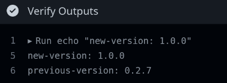
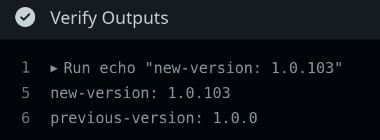
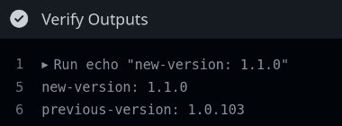

# Introduction

<!--  -->
<!-- https://github.com/marketplace/actions/count-action-users -->
<!--  -->

Language/content agnostic method of automatically determining the [semantic version](https://semver.org/) for a product based on _branch_ merge history with MINIMAL [discipline dependencies](https://github.com/marketplace/actions/gitops-automatic-versioning?#discipline-dependency).

This is accomplished by counting the merges of branches matching the [naming scheme](#branch-naming-scheme) into the [main|master] branch. Folks familiar with Scrum/SAFe or GitFlow/fooFlow strategies will recognize this scheme.

**Yes**, this can be implemented in repos that previously used different version increment methods.

> [Convenience link to this action on the marketplace](https://github.com/marketplace/actions/gitops-automatic-versioning)

## Recent Changes

- 0.2.9: Fix 'ops' increments; add user friendly error outputs.

## Usage

### Setup

<dl>
  <dt>Repository Setup</dt>
    <dd>1. Disable squash merging in the repository settings.</dd>
    <dd>?. If you have a previously established version for the repo, ensure it's tagged like: 'MAJOR.MINOR.PATCH'. 
    For example, if you have a tag like 'v1.2.3', you will want to add a tag like '1.2.3' to that commit as well, which might look like:</dd>
    <dd><pre>
git checkout v1.2.3
git tag 1.2.3
git push --tags</pre></dd>
  <dt>Workflow Setup</dt>
    <dd>2. Ensure your action executes a checkout step prior to using this action.</dd>
    <dd>3. Use the outputs from this action as desired. For example, you might use it to update the version of an npm package:</dd>
    <dd>
    <pre>npm version ${{ steps.gitops-autover.outputs.new-version }}</pre>
    </dd>
    <dd>4. Tag the repo with the new version at some point in the workflow.
  <dt>Team Setup</dt>
    <dd>5. Ensure the iteration team adheres to the branch naming scheme defined below. Here's an example workflow. Bonus points for integrating branch management into your issue tracking system.</dd>
    <dd><pre>
git checkout -b fix/not-a-feature
git commit --allow-empty -m "This was a bug and not a feature after all..."
git push --set-upstream origin fix/not-a-feature
# THEN: Click the link to create a PR & merge it</pre></dd>
</dl>

### Outputs

<dl>
  <dt>new-version: [string]</dt>
    <dd>The newly detected version.</dd>
  <dt>previous-version: [string]</dt>
    <dd>The previous version.</dd>
</dl>

### Example GH Action Workflows

Below is a valid workflow utilizing this action. If you wanted to extend it to do something like update a 'package.json' version, for example, you would simply create a step that runs: `npm version $NEW_VERSION`.

    name: gitops-autover

    on:
      push:
        branches:
        - main

    jobs:
      use-action:
        name: Verify GitOps AutoVer Action
        runs-on: ubuntu-latest
        steps:
        - uses: actions/checkout@v3
        - name: Run GitOps Automatic Versioning Action
          id: gitops-autover
          uses: AlexAtkinson/github-action-gitops-autover@0.2.9
        - name: Verify Outputs
          run: |
            NEW_VERSION=${{ steps.gitops-autover.outputs.new-version }}
            echo "new-version: $NEW_VERSION"
            PREVIOUS_VERSION=${{ steps.gitops-autover.outputs.previous-version }}
            echo "previous-version: $PREVIOUS_VERSION"

This results in outputs like:

_major:_

_patch:_

_minor:_

> Q: _How did you execute 103 merges?_ 
  A: You can use the bump scripts in the scripts directory of this 
  repo, like: './scripts/bumpPatch.sh 42'. (Does not work with branch protection enabled) 

Additionally, this repo uses its own action for versioning, so feel free to investigate that workflow for another example.

### A More Complete Example

    name: gitops-autover-example
    on:
      push:
        branches:
          - main
    jobs:
      init:
        name: Initialize
        runs-on: ubuntu-latest
        outputs:
          REPOSITORY: ${{ steps.init.outputs.REPOSITORY }}
          PRODUCT: ${{ steps.init.outputs.PRODUCT_NAME }}
          PRODUCT_NAME_LOWER: ${{ steps.init.outputs.PRODUCT_NAME_LOWER }}
          NEW_VERSION: ${{ steps.gitops-autover.outputs.new-version }}
          PREVIOUS_VERSION: ${{ steps.gitops-autover.outputs.previous-version }}
        steps:
        - name: Checkout Source
          uses: actions/checkout@v3
          with:
            lfs: true
            fetch-depth: 0
        - name: Initialize
          id: init
          run: |
            # Detect repo name.
            REPOSITORY=${PWD##*/}
            echo "REPOSITORY=$REPOSITORY" >> $GITHUB_OUTPUT
            # Autodetect product name. Eg:
            #   A repo named cool-corp-awesome-docker will result in
            #   the image being pushed as: awesome-docker:x.x.x
            [[ $(echo -n "$(cut -d- -f3- <<< ${REPOSITORY})" | wc -c) -gt 0 ]] && PRODUCT_NAME=$(cut -d- -f3- <<< ${REPOSITORY})
            [[ $(echo -n "$(cut -d- -f3- <<< ${REPOSITORY})" | wc -c) -eq 0 ]] && PRODUCT_NAME=default
            echo "PRODUCT_NAME=$PRODUCT_NAME" >> $GITHUB_OUTPUT
            PRODUCT_NAME_LOWER=${PRODUCT_NAME,,}
            echo "PRODUCT_NAME_LOWER=$PRODUCT_NAME_LOWER" >> $GITHUB_OUTPUT
        - name: GitOps Automatic Versioning
          id: gitops-autover
          uses: AlexAtkinson/github-action-gitops-autover@0.2.9
      build:
        name: "Build"
        runs-on: ubuntu-latest
        needs: [init]
        steps:
          - name: "Build"
            run: |
              echo "SUCCESSFUL BUILD" > "${{ needs.init.outputs.PRODUCT_NAME_LOWER }}.${{ needs.init.outputs.NEW_VERSION }}.txt"
              # Then bolt on extras such as slack notify or github release actions as needed.

## Discipline Dependency

### Branch Naming Scheme

This action depends _only_ on the following _branch naming scheme_ being observed.

| Branch Name    | Increment | Description                            |
| -------------  | --------- | -------------------------------------- |
| feature/.*     | Minor     | Product features.                      |
| enhancement/.* | Minor     | Product enhancements.                  |
| **fix/.***     | Patch     | Product fixes                          |
| bugfix/.*      | Patch     | You should use fix.                    |
| hotfix/.*      | Patch     | Are you from the past?                 |
| ops/.*         | Patch     | Enables ops changes to trigger builds. |

For example, the name of the branch for a new awesome feature named Awesome Feature, might be: 'feature/awesome_feature'.

## Appropriate Use Cases

This action is _most_ suitable for git projects with the following operational design:

- Each merge into main|master is intended to produce an artifact, following the "everything is potentially releasabe" approach.

This action is _not_ suitable for projects requiring:
  - pre-release, beta, etc., type fields. Such projects should depend upon their own language native tooling.
  - specific version numbers to be planned and orchestrated ahead of time (usually marketing efforts).
    - Exception: Major releases. These can be actioned on demand as outlined below.
  - rebase merges. Reminder: this action _depends_ on merge commit messages.
    - Exception: Patterns like: main < (merge-commit) < staging-branch < (rebase) work-branches
      - As long as main|master gets a merge commit message, everyone is happy.

## Version Format

Versions are returned only in the following format:
'MAJOR.MINOR.PATCH'.

## Major Increments

MAJOR version increments depend upon manual intervention to trigger as it is not practical to automatically detect either major refactoring or _accepted/planned_ breaking changes to a product. Human input _informs_ the tool of such MAJOR increment qualifying scenarios.

This increment can be accomplished in one of the following ways:

1. Push a commit message containing: '+semver: [major|breaking]'. For example:

        git commit --allow-empty -m "+semver: major"
        git push

2. Push the MAJOR tag manually. That this is the _less desirable_ option as it will require the merge of a qualifying branch to iterate the version number, making the first possible version that could be produced 'n.0.1'. Assuming successful build and testing.

        git tag 1.0.0
        git push --tags

## Version Increment Logic

For those interested, here's some pseudo code:

    lastMajor = Extract from previous git tag (why option 1 is recommended)
    lastMinor = Extract from previous git tag
    lastPatch = Extract from previous git tag
    IF no previous git tag; THEN
        MAJOR = 0
        MINOR = 0
        PATCH = 0
    IF major increment indicator; THEN
        MAJOR = lastMajor + 1
        MINOR = 0
        PATCH = 0
    ELSEIF merged feature/.* or enhancement/.* branches; THEN
        MAJOR = lastMajor
        MINOR = lastMinor + count of merged branches
        PATCH = 0
    ELSEIF merged bugfix/.* or hotfix/.* branches; THEN
        MAJOR = lastMajor
        MINOR = lastMinor
        PATCH = lastPatch + count of merged branches

## [Known|Non]-Issues

- If there are no merges of branches conforming to the above naming scheme, this action will fail with the following output:

        ERROR: No feature, enhancement, fix, bugfix, hotfix, or ops branches detected!

  - When encountering this scenario, and a build is desired, you can simply create a branch with the appropriate naming convention and an empty commit, then merge it. Or use the bump scripts in the 'scripts/' directory of the repo for this action.

- Merged branches not conforming to the above naming scheme will simply be ignored.
  - HINT: This can be useful when you don't want to increment the version.
    - Align this with build 'on:push:branches:' workflow configuration to avoid unnecessary builds.
- The version output does not have a 'v' prefix.
  - If you would like a 'v' prefix to your versions, add it to your logic when using the output from this action. For example:

        echo "The new version is v${{ steps.detect-version.outputs.new-version }}"
                                 ^ here

- If both 'main' and 'master' branches exist remotely: FAIL
  - This will not be changed.

- Squash merging must be disabled. This is required to populate the git log with the commit messages issued from the git provider.

## Future Enhancements

PRs are welcome.

- input(s): iteration-branches (map) - inform MINOR and PATCH incrementing branch name patterns.
- input(s): mono-mode (bool) - version subdirs discretely
- ~~CAN'T DO~~: DONE: unshallow from last version tag to latest commit to... Seems a limitation of (git at first glance). See the [Checkout From Tag](https://github.com/marketplace/actions/checkout-from-tag) action.
